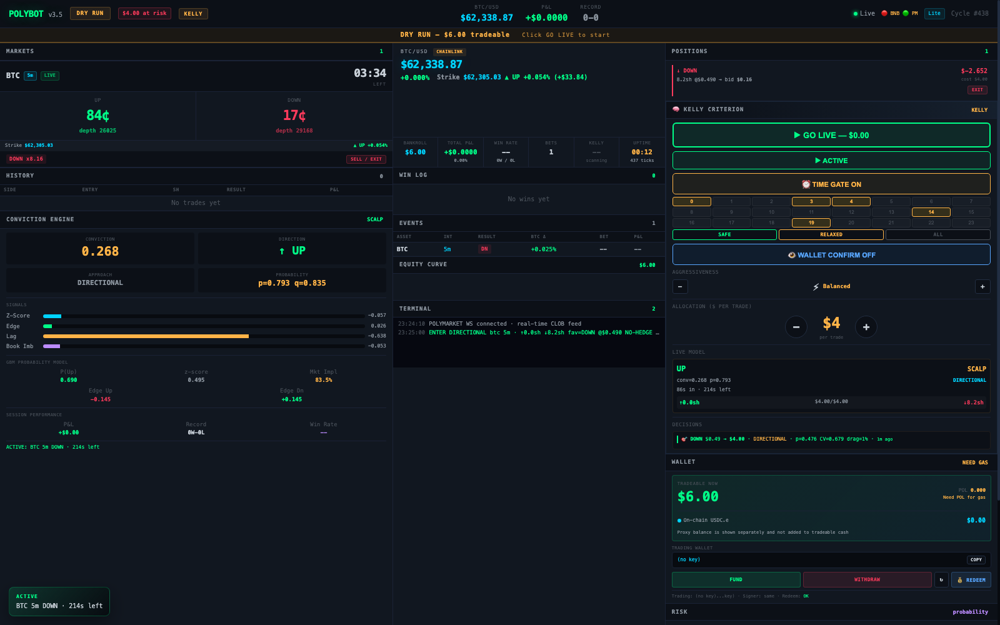

# Matthew Cicco — Project Portfolio

I build data systems that hold up in production — where the data arrives late, the sources disagree, the cost per query is real, and someone makes a decision from the output. My range spans **large-scale analytical SQL** (BigQuery, SQL Server), **data engineering** (incremental pipelines, dimensional modeling, data-quality gates), and **real-time Python systems** (async services, live market data, instrumentation).

Professionally that has meant building the analytics layer for a national retail delivery network — reporting I owned reached 200+ field and leadership users, and my capacity logic fed downstream planning systems — plus earlier analytics roles at UPS and UL Environment. Personally, a home lab of services running 24/7. Information Systems BBA (Kennesaw State University, CS minor).

**Every project here runs.** Datasets are synthetic and generated by committed, seeded scripts, so anything in this repo can be cloned and reproduced exactly.

📫 **Contact:** ciccomatthew@gmail.com · 🌐 **Website:** [cloud-data92.github.io/Portfolio](https://cloud-data92.github.io/Portfolio/)

---

## 🧭 Quick Tour — find what you came to see

| Looking for evidence of… | Start here |
|---|---|
| **Advanced SQL on real business problems** | [Enterprise Delivery Analytics](projects/enterprise-delivery-analytics/) — 10 case studies, each opening with the business problem |
| **SQL you can run yourself** | [SQL Stock Market Analytics](projects/sql-stock-analytics/) — clone it, two commands, every result reproduces |
| **Data engineering & ETL discipline** | [ETL → Star-Schema Warehouse](projects/etl-data-warehouse/) and [case study 10](projects/enterprise-delivery-analytics/sql/10_incremental_merge_architecture.sql) (incremental `MERGE`) |
| **Real-time Python / systems engineering** | [PolyBot](projects/trading-bot/) — async engine, live order books, risk gates, dashboard |
| **Practical, bounded AI integration** | PolyBot's [advisory-only LLM sidecar](projects/trading-bot/#the-ai-advisor-sidecar) and the [local-AI Discord bots](projects/discord-bots/) |
| **Tableau & BI architecture** | [TABLEAU.md](projects/enterprise-delivery-analytics/TABLEAU.md) — semantic layer, LOD expressions, extract strategy, and a full [operations dashboard](projects/enterprise-delivery-analytics/assets/tableau_dashboard.png) |
| **Visualization** | The [ops dashboard](projects/enterprise-delivery-analytics/#the-dashboard-these-queries-serve), [SQL result charts](projects/sql-stock-analytics/#visualized-results), PolyBot's live dashboard |
| **Data quality & validation habits** | [Validation query suite](projects/enterprise-delivery-analytics/validation/data_quality_checks.sql) and the ETL project's reject quarantine |
| **Cost & performance engineering** | [PERFORMANCE.md](projects/enterprise-delivery-analytics/PERFORMANCE.md) — partition pruning math, spatial pre-filtering, query complexity analysis |
| **Testing & engineering rigor** | [ETL unit tests](projects/etl-data-warehouse/test_etl.py) (18 tests), [signal robustness tests](projects/trading-bot/tests/test_signal_robustness.py), CI on every push |

---

## 📂 Projects

| Project | What it shows | Status |
|---|---|---|
| [🚚 Enterprise Delivery Analytics](projects/enterprise-delivery-analytics/) | 10 last-mile logistics case studies in BigQuery + T-SQL — capacity utilization, geospatial serviceability, delivery-attempt modeling, KPI scoring, cross-system reconciliation, incremental load architecture, plus [cost/performance analysis](projects/enterprise-delivery-analytics/PERFORMANCE.md) | ✅ Published |
| [📊 SQL Stock Market Analytics](projects/sql-stock-analytics/) | Advanced SQL: schema design, joins, CTEs, window functions, portfolio P&L analysis, plus a Tableau-ready data pipeline | ✅ Complete & runnable |
| [🏗️ ETL Pipeline → Star-Schema Warehouse](projects/etl-data-warehouse/) | Production-style ETL: messy-data cleansing, reject quarantine, data-quality gates, Kimball dimensional modeling, idempotent loads, unit tests | ✅ Complete & runnable |
| [📈 PolyBot — Trading Engine](projects/trading-bot/) | 24/7 async Python engine for Polymarket BTC binary markets: multi-timeframe momentum signals, Kelly-criterion sizing, SQLite trade history, real-time dashboard, and an LLM advisor that can suggest but never execute | ✅ Migrated & documented |
| [🤖 discord-ai-bot](projects/discord-bots/discord-ai-bot/) | Discord chatbot backed by a fully local LLM (Ollama) — private, zero API cost, per-message model switching | ✅ Migrated & documented |
| [📉 stock-scanner](projects/discord-bots/stock-scanner/) | Watchlist scanner flagging unusual-volume moves, with a local-LLM analysis hook | ✅ Migrated & documented |

*PolyBot's real-time dashboard, captured live in dry-run mode — [see the project →](projects/trading-bot/)*

---

## 🧠 How I use AI — strategically, not blindly

- **Bounded advisor, deterministic core.** The trading bot's LLM sidecar reads engine
  state and writes schema-validated "nudges" to a file the engine may consult — but the
  LLM *cannot* place or cancel orders, and if it's down the bot is unchanged. AI adds
  judgment at the margins; auditable code keeps control.
- **Local models where privacy and cost matter.** The Discord bot and scanner run on
  Ollama models on my own hardware — no per-token bills, no data leaving the machine.
- **Agents for repeatable work.** I run scheduled AI agents (launchd on a Mac mini
  home server) for things like daily job-posting digests delivered over iMessage —
  automation where the output is checked, not worshipped.

---

## 🛠️ Technical Skills

- **SQL** — window functions, CTE pipelines, pivots, geospatial predicates, grain control, temporal/current-state modeling, defensive math. Dialects: BigQuery, T-SQL (SQL Server), SQLite, MySQL
- **Data engineering** — dimensional (star-schema) modeling, incremental `MERGE` loads with late-data handling, partitioning & clustering, data-quality gates and reject quarantine, idempotent pipeline design
- **Cloud & warehouse** — Google BigQuery (GIS functions, scheduled queries, partition-aware cost engineering), AWS EC2 for always-on services
- **BI & visualization** — Tableau semantic-layer design, LOD expressions, extract architecture, exception-first dashboard design
- **Python** — async services (`asyncio`, HTTP/2 pooling), API integration, data pipelines, `unittest`/`pytest`, instrumentation
- **Engineering practice** — Git/GitHub, CI via GitHub Actions, unit testing, secrets hygiene, technical writing
- **Also** — Node.js, R, SAS, C#, ASP.NET, Excel/VBA, HTML/CSS

---

## 🔬 Engineering Practices

The habits that show up across every project here:

- **Reproducibility** — every dataset is synthetic and generated by a seeded, committed script; clone any project and the numbers match exactly
- **Testing** — [18 unit tests](projects/etl-data-warehouse/test_etl.py) on the ETL transform layer, [robustness tests](projects/trading-bot/tests/test_signal_robustness.py) on the trading signal engine
- **CI** — secret scanning and site deploys run on every push (badges above)
- **Cost & complexity awareness** — [PERFORMANCE.md](projects/enterprise-delivery-analytics/PERFORMANCE.md) analyzes scan volume, partition pruning, and the complexity of each analytical pattern
- **Failing loud** — data-quality gates halt bad loads rather than publishing quietly wrong numbers; rejected rows are quarantined *with reasons*
- **Honest scope** — where a project's limits are known, the README says so plainly

---

## 🔒 Security Practices in This Repo

No API keys, tokens, or credentials are ever committed here:

- All secrets load from environment variables / `.env` files, which are **git-ignored** — only `.env.example` templates (with fake placeholder values) are committed
- A [secret-scanning CI workflow](.github/workflows/secret-scan.yml) (Gitleaks) runs on every push and pull request
- GitHub push protection is enabled on the repository
- See [SECURITY.md](SECURITY.md) for the full checklist I follow

---

## 📄 License & Provenance

Code and documentation here are released under the [MIT License](LICENSE). [NOTICE.md](NOTICE.md) states the provenance of each project — in particular that the logistics case studies are original work written for this repository against invented schemas, containing no employer code, data, identifiers, or configuration.

---

*This portfolio is a living repo — projects are added and improved over time.*
