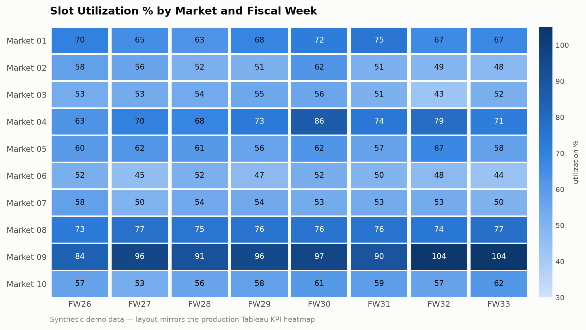
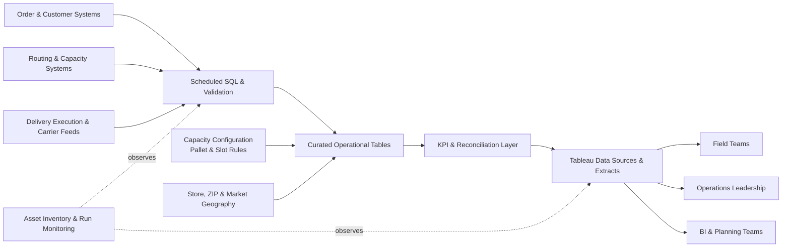

# 🚚 Enterprise Delivery Analytics — SQL & Systems Case Studies

**Last-mile delivery at enterprise scale: routing, capacity, geospatial serviceability, KPI reporting, and the reliability of the analytics layer behind them.**

At Home Depot, my work centered on the data systems supporting final-mile delivery — car/van and flatbed delivery, slot-based capacity markets, pallet allocation, route utilization, and the SQL/Tableau reporting used by field teams and leadership. I built a large-scale logistics report used by **200+ field and leadership users**, owned pallet-calculation logic feeding downstream planning systems, and supported major initiatives including an always-on operations transition, flatbed delivery center integration, and a slot-based capacity-engine pilot.

> **Publication note:** every query in this folder is a **sanitized reconstruction** of production logic I designed and maintained. Table names, dataset names, status codes, and configuration values are generalized; no proprietary data, credentials, customer information, or confidential thresholds appear anywhere. The business problems, analytical grain, SQL techniques, and edge cases are the real thing — that's the point.

---

## The Case Studies

Ten worked examples, each a real operational problem. Every file opens with the business problem and closes with the design decisions.

| # | Case study | Business question | Key SQL techniques |
|---|---|---|---|
| [01](sql/01_route_hours_utilization.sql) | Route hours utilization | How much of each route's operating window is actually used? | Planned-vs-actual temporal logic, `NULLIF` zero-denominator guards, unit conversion |
| [02](sql/02_slot_utilization_weekly_pivot.sql) | Weekly slot utilization pivot | How much delivery capacity was consumed this week, by market/type/ZIP group? | `PIVOT`, `SAFE_DIVIDE`, dynamic week boundaries, aggregate-before-divide |
| [03](sql/03_geospatial_store_serviceability.sql) | Geospatial serviceability | Which eligible stores are closest to each facility or ZIP? | `ST_GEOGPOINT`, `ST_DISTANCE`, `ST_DWITHIN`, deterministic ranking, `ARRAY_AGG` |
| [04](sql/04_customer_order_attempt_rollup.sql) | Delivery attempt rollup | How many *legitimate* delivery attempts did each order get? | Grain control, conditional `COUNT(DISTINCT)`, `STRING_AGG`, status-domain rules |
| [05](sql/05_latest_route_alert_state.sql) | Current alert state | What is the *current* actionable alert per stop and route? | `ROW_NUMBER`/`QUALIFY`, temporal modeling, deterministic tie-breaking |
| [06](sql/06_delivery_window_normalization.sql) | Delivery-window labels | Which windows are premium, and how do archive rules apply? | Nested `CASE`, Boolean precedence, midnight/noon edge cases (T-SQL) |
| [07](sql/07_pallet_slot_capacity_model.sql) | Pallet → slot capacity | Is a market over capacity, or just imbalanced across customer segments? | Multi-CTE pipeline, effective-dated config, exception taxonomy |
| [08](sql/08_market_kpi_scoring.sql) | Market KPI scoring | Which markets need attention first, and *why*? | `PERCENT_RANK` normalization, metric directionality, weighted scoring |
| [09](sql/09_cross_system_reconciliation.sql) | Cross-system reconciliation | Do the order, route, and execution systems agree? | `FULL OUTER JOIN`, latest-record dedup, actionable exception states |
| [10](sql/10_incremental_merge_architecture.sql) | Incremental load architecture | How do millions of rows reach Tableau reliably every day? | Idempotent `MERGE`, late-data lookback, partitioning/clustering |

Plus [`validation/data_quality_checks.sql`](validation/data_quality_checks.sql) — the checks that prove the models correct (grain uniqueness, conflicting attributes, bad coordinates, coverage gaps, outliers).

---

## The KPI Heatmap

The scored output of case studies 02/08 fed Tableau heatmaps used for routing and capacity decisions. This rendering (synthetic data, generated by [`assets/make_heatmap.py`](assets/make_heatmap.py)) mirrors the production layout:

Reading it the way operations did: **Market 09** is trending into over-capacity (104%) — a candidate for slot-cap or routing changes; **Market 06** is persistently under-utilized — spare capacity that could absorb neighboring demand.

---

## End-to-End Data Flow

The common theme: turning fragmented operational data into systems people can act on. SQL is one layer of a pipeline with sources, schedules, dependencies, and downstream consumers.

Analytics assets were managed as an operating system: every scheduled query, table, extract, and workbook had an owner, a schedule, a runtime budget, upstream/downstream dependencies, and a documented failure impact — so when something broke, the blast radius was known before the first question arrived.

---

## How I Approach a Data-System Problem

1. **Define the operational decision.** What action will someone take because this output exists?
2. **Identify the authoritative sources.** Which system owns order status, route timing, capacity, geography?
3. **Define the grain.** Is a row an order, stop, route, truck, ZIP, market-day, or market-week?
4. **Normalize business dimensions once.** Source codes become stable customer/service categories in one place.
5. **Make state transitions explicit.** Planned, active, completed, failed, archived, and late-arriving records never mix accidentally.
6. **Protect the math.** `COALESCE`, `NULLIF`, `SAFE_CAST`, `SAFE_DIVIDE` — expose invalid states, never hide them.
7. **Design for validation.** Source counts, reconciliation statuses, freshness timestamps, drill-through IDs.
8. **Design for downstream consumers.** Tableau receives stable, documented fields at the correct grain.
9. **Treat schedule and performance as correctness.** Partitioning, bytes processed, refresh order, runtime.
10. **Assign ownership.** Every business-critical asset has a named owner and a recovery path.

---

## Capability Matrix

| Capability | Where it shows up |
|---|---|
| Complex SQL (CTEs, conditional aggregation, pivots) | Case studies 02, 04, 06, 07 |
| Window functions (`ROW_NUMBER`, `RANK`, rolling frames, `QUALIFY`) | 05, 08, 09, 10 |
| Geospatial analytics (BigQuery GIS) | 03 |
| Defensive SQL (`SAFE_DIVIDE`, `NULLIF`, `SAFE_CAST`, `COALESCE`) | everywhere |
| Data quality & reconciliation | 09, validation suite |
| Capacity & operations modeling | 01, 02, 07, 08 |
| Data engineering (incremental loads, partitioning, BI architecture) | 10 |
| SQL Server (T-SQL) and BigQuery dialects | 01, 06 vs. 02–05, 08–10 |
| Tableau reporting layer design | 02, 08, 10 + heatmap above |
