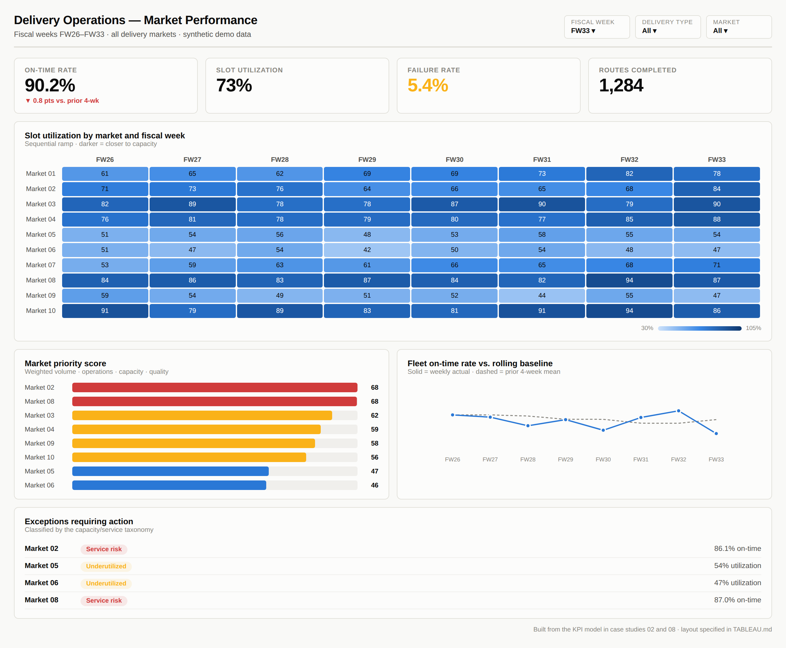
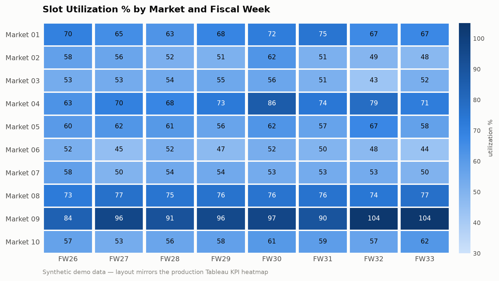
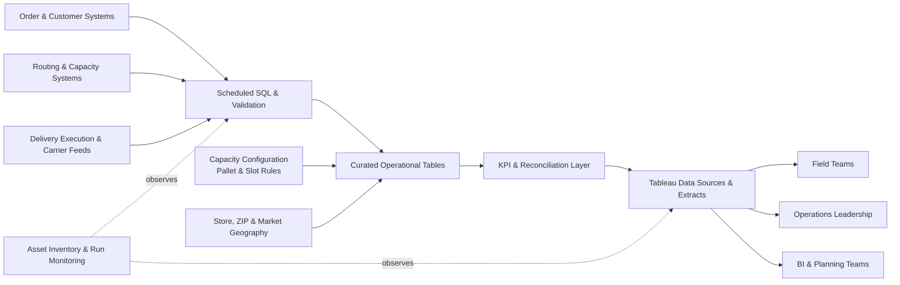

# 🚚 Enterprise Delivery Analytics — SQL & Systems Case Studies

**Last-mile delivery at enterprise scale: routing, capacity, geospatial serviceability, KPI reporting, and the reliability of the analytics layer behind them.**

Last-mile delivery is a rich source of genuinely hard data problems: the data is high-volume and late-arriving, several systems disagree about the same order, capacity is a hard physical constraint, and the output drives decisions that move trucks. My professional background is in exactly this domain — building the analytics layer for a national retail delivery network, where reporting I owned reached 200+ field and leadership users and my capacity logic fed downstream planning systems.

This project works ten of those problem classes end to end, in BigQuery and T-SQL.

> **What this is:** original SQL written for this repository, against schemas invented for it, demonstrating industry-standard techniques on well-known categories of logistics problem. It is **not** any employer's code — no production query, schema, configuration, or data has been copied here, and no internal identifiers, thresholds, or program names appear. Every number shown is synthetic and produced by the scripts committed alongside. See [NOTICE.md](../../NOTICE.md) for the full provenance statement.

---

## The Case Studies

Ten worked examples, each a real operational problem. Every file opens with the business problem and closes with the design decisions.

| # | Case study | Business question | Key SQL techniques |
|---|---|---|---|
| [01](sql/01_route_hours_utilization.sql) | Route hours utilization | How much of each route's operating window is actually used? | Planned-vs-actual temporal logic, `NULLIF` zero-denominator guards, unit conversion |
| [02](sql/02_slot_utilization_weekly_pivot.sql) | Weekly slot utilization pivot | How much delivery capacity was consumed this week, by market/type/ZIP group? | `PIVOT`, `SAFE_DIVIDE`, dynamic week boundaries, aggregate-before-divide |
| [03](sql/03_geospatial_store_serviceability.sql) | Geospatial serviceability | Which eligible stores are closest to each facility or ZIP? | `ST_GEOGPOINT`, `ST_DISTANCE`, `ST_DWITHIN`, deterministic ranking, `ARRAY_AGG` |
| [04](sql/04_customer_order_attempt_rollup.sql) | Delivery attempt rollup | How many *legitimate* delivery attempts did each order get? | Grain control, conditional `COUNT(DISTINCT)`, `STRING_AGG`, status-domain rules |
| [05](sql/05_latest_route_alert_state.sql) | Current alert state | What is the *current* actionable alert per stop and route? | `ROW_NUMBER`/`QUALIFY`, temporal modeling, deterministic tie-breaking |
| [06](sql/06_delivery_window_normalization.sql) | Delivery-window labels | Which windows are premium, and how do archive rules apply? | Nested `CASE`, Boolean precedence, midnight/noon edge cases (T-SQL) |
| [07](sql/07_pallet_slot_capacity_model.sql) | Pallet → slot capacity | Is a market over capacity, or just imbalanced across customer segments? | Multi-CTE pipeline, effective-dated config, exception taxonomy |
| [08](sql/08_market_kpi_scoring.sql) | Market KPI scoring | Which markets need attention first, and *why*? | `PERCENT_RANK` normalization, metric directionality, weighted scoring |
| [09](sql/09_cross_system_reconciliation.sql) | Cross-system reconciliation | Do the order, route, and execution systems agree? | `FULL OUTER JOIN`, latest-record dedup, actionable exception states |
| [10](sql/10_incremental_merge_architecture.sql) | Incremental load architecture | How do millions of rows reach Tableau reliably every day? | Idempotent `MERGE`, late-data lookback, partitioning/clustering |

Plus [`validation/data_quality_checks.sql`](validation/data_quality_checks.sql) — the checks that prove the models correct (grain uniqueness, conflicting attributes, bad coordinates, coverage gaps, outliers).

---

## SQL Techniques at a Glance

Four short excerpts, so the level is visible without opening a file.

**Geospatial top-N with deterministic tie-breaking** — spatial pre-filter prunes the candidate space before any exact distance math runs ([case 03](sql/03_geospatial_store_serviceability.sql)):

```sql
ROW_NUMBER() OVER (
    PARTITION BY facility_id
    ORDER BY distance_miles, store_id   -- store_id breaks ties → stable results
) AS distance_rank
...
WHERE ST_DWITHIN(f.facility_geog, s.store_geog, 300 * 1609.344)
```

**Conditional distinct counting to fix an inflated metric** — the source repeats a work order across status events, so a naive `COUNT(*)` overstates delivery attempts ([case 04](sql/04_customer_order_attempt_rollup.sql)):

```sql
COUNT(DISTINCT CASE
    WHEN is_cancelled = 'N'
     AND delivery_status_code NOT IN (1, 6, 20)   -- cancels/non-attempts excluded
    THEN work_order_id
END) AS total_attempts
```

**Rolling baselines and peer percentiles in one pass** — trend and rank computed together, so a market can be compared to its own history *and* its peers ([case 08](sql/08_market_kpi_scoring.sql)):

```sql
AVG(hours_utilization) OVER (
    PARTITION BY market_id ORDER BY fiscal_year_week
    ROWS BETWEEN 4 PRECEDING AND 1 PRECEDING       -- excludes the current week
) AS prior_4_week_hours_util,

PERCENT_RANK() OVER (
    PARTITION BY fiscal_year_week ORDER BY on_time_rate
) AS on_time_peer_percentile
```

**Idempotent incremental load** — `QUALIFY` deduplicates the source *inside* the `MERGE`, so reruns can never double-count ([case 10](sql/10_incremental_merge_architecture.sql)):

```sql
WHERE updated_timestamp >= TIMESTAMP_SUB(@last_successful_refresh, INTERVAL 2 DAY)
QUALIFY ROW_NUMBER() OVER (
    PARTITION BY order_id, work_order_id ORDER BY updated_timestamp DESC
) = 1
```

---

## The Dashboard These Queries Serve

SQL is only half the job — someone has to act on the output. This is the operations dashboard the KPI model feeds, generated from synthetic data by [`assets/make_dashboard.py`](assets/make_dashboard.py):



**[→ TABLEAU.md](TABLEAU.md)** documents the semantic layer behind it: where I draw the line between SQL-owned business logic and Tableau-owned presentation logic, the Level-of-Detail expressions (`FIXED` / `INCLUDE` / `EXCLUDE`) that genuinely earn their place and the context-filter trap that makes `FIXED` silently wrong, the calculated fields behind each panel, and the two-source extract architecture — including why Tableau's incremental refresh quietly duplicates late-arriving corrections and how the upstream `MERGE` fixes it.

### The heatmap on its own

Also rendered standalone by [`assets/make_heatmap.py`](assets/make_heatmap.py):



Reading it the way an operations team would: **Market 09** is trending into over-capacity (104%) — a candidate for capacity-cap or routing changes; **Market 06** is persistently under-utilized — spare capacity that could absorb neighboring demand. The design intent is exception-first: the eye should land on the outliers without reading a single number.

---

## End-to-End Data Flow

The common theme: turning fragmented operational data into systems people can act on. SQL is one layer of a pipeline with sources, schedules, dependencies, and downstream consumers.


```mermaid
flowchart LR
    A[Order & Customer Systems] --> D[Scheduled SQL & Validation]
    B[Routing & Capacity Systems] --> D
    C[Delivery Execution & Carrier Feeds] --> D

    D --> E[Curated Operational Tables]
    E --> F[KPI & Reconciliation Layer]
    F --> G[Tableau Data Sources & Extracts]
    G --> H[Field Teams]
    G --> I[Operations Leadership]
    G --> J[BI & Planning Teams]

    K[Capacity Configuration<br/>Pallet & Slot Rules] --> E
    L[Store, ZIP & Market Geography] --> E
    M[Asset Inventory & Run Monitoring] -.observes.-> D
    M -.observes.-> G
```

The operating principle: analytics assets are production software. Every scheduled query, table, extract, and dashboard needs an owner, a schedule, a runtime budget, declared upstream/downstream dependencies, and a documented failure impact — so when something breaks, the blast radius is known before the first question arrives.

---

## How I Approach a Data-System Problem

1. **Define the operational decision.** What action will someone take because this output exists?
2. **Identify the authoritative sources.** Which system owns order status, route timing, capacity, geography?
3. **Define the grain.** Is a row an order, stop, route, truck, ZIP, market-day, or market-week?
4. **Normalize business dimensions once.** Source codes become stable customer/service categories in one place.
5. **Make state transitions explicit.** Planned, active, completed, failed, archived, and late-arriving records never mix accidentally.
6. **Protect the math.** `COALESCE`, `NULLIF`, `SAFE_CAST`, `SAFE_DIVIDE` — expose invalid states, never hide them.
7. **Design for validation.** Source counts, reconciliation statuses, freshness timestamps, drill-through IDs.
8. **Design for downstream consumers.** Tableau receives stable, documented fields at the correct grain.
9. **Treat schedule and performance as correctness.** Partitioning, bytes processed, refresh order, runtime.
10. **Assign ownership.** Every business-critical asset has a named owner and a recovery path.

---

## Capability Matrix

| Capability | Where it shows up |
|---|---|
| Complex SQL (CTEs, conditional aggregation, pivots) | Case studies 02, 04, 06, 07 |
| Window functions (`ROW_NUMBER`, `RANK`, rolling frames, `QUALIFY`) | 05, 08, 09, 10 |
| Geospatial analytics (BigQuery GIS) | 03 |
| Defensive SQL (`SAFE_DIVIDE`, `NULLIF`, `SAFE_CAST`, `COALESCE`) | everywhere |
| Data quality & reconciliation | 09, validation suite |
| Capacity & operations modeling | 01, 02, 07, 08 |
| Data engineering (incremental loads, partitioning, BI architecture) | 10 |
| SQL Server (T-SQL) and BigQuery dialects | 01, 06 vs. 02–05, 08–10 |
| Tableau semantic layer, LOD expressions, extract architecture | [TABLEAU.md](TABLEAU.md) + dashboard above |
| Query cost & performance engineering | [PERFORMANCE.md](PERFORMANCE.md) |

---

## Cost & Performance

SQL that returns the right answer can still be the wrong solution if it's too slow, too expensive, or too late for the decision it informs. **[PERFORMANCE.md](PERFORMANCE.md)** works through the cost engineering behind these queries: partition pruning arithmetic (an ~80× scan reduction on the order-detail fact), spatial pre-filtering that cuts a nearest-store search from 82M candidate pairs to ~180K, the complexity of each analytical pattern and where it degrades, why incremental `MERGE` beats full refresh by ~180× per run, and what I'd instrument to replace those estimates with measurements.
