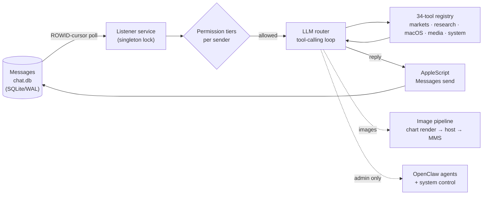

# 💬 MemBot — an AI assistant that lives in iMessage

A personal AI assistant you text like a contact. It runs 24/7 on my Mac mini,
watches for new iMessages, and answers with a tool-calling LLM that can check
stocks, run options analytics, search the web, generate charts and memes, save
notes and reminders, and control the other agents on the machine — all from a
text message, from any device, with nothing installed on the phone.

Running continuously since **March 2026**. One Python service, **5,300+ lines**,
a **34-tool registry**, and multi-model routing across local and hosted LLMs.

> **Why this is a case study rather than published code:** the service is
> deeply personal by design — its config includes real phone numbers, private
> conversation context, and a custom personality tuned for my group chats.
> Publishing a scrubbed version would mean publishing something I don't
> actually run, which defeats the point of this portfolio. So this page
> documents the real system's architecture and the engineering decisions in
> it, with representative code patterns rewritten clean.

## Architecture



**The loop:** a launchd-managed service polls the Messages database for rows
newer than a persisted ROWID cursor, resolves the sender against a permission
tier, hands the message (plus recent chat context and any attached images) to
an LLM with a tool schema, executes whatever tools the model calls, and
delivers the reply back into the same conversation via AppleScript — so the
answer arrives as a normal blue bubble.

## Engineering decisions worth asking me about

- **Read the database, not a private API.** New messages are detected by
  polling `chat.db` with a persisted ROWID cursor — restart-safe, no fragile
  private frameworks, and full access to conversation history for context.
  Disk access is granted to a dedicated wrapper app, not to the terminal.
- **A singleton lock that fights back.** Two instances of a chat bot means
  double replies. On startup the service checks the lockfile, verifies whether
  the old PID is genuinely alive, and kills stale instances before taking over.
- **Permission tiers per sender.** Family and friends can use the fun and
  research tools; `run_command`, agent control, and system tools are gated to
  the admin tier, matched on normalized phone-number digits. A text message is
  an untrusted input — the bot treats it like one.
- **`stay_silent` is a tool.** In group chats, the hardest behavior to teach a
  chatbot is knowing when it isn't being talked to. Making silence an explicit
  tool call turns "don't reply" into a first-class, observable decision.
- **Cost-tiered model routing.** Requests try free and local models first and
  escalate only when the task needs more — the same cost-optimization
  philosophy as the rest of my home lab, where the whole fleet's monthly AI
  bill stays at coffee money.
- **Images are first-class.** Incoming photos are extracted from the Messages
  attachment store and passed to a vision model; outgoing charts and memes are
  rendered locally, hosted, and delivered as MMS.

## The tool registry, grouped

| Domain | Tools |
|---|---|
| **Markets & options** | live quotes, technical analysis, intraday/daily charts, options-chain scans, full options reports rendered as formatted documents |
| **Research & news** | web search, URL reading, deep research runs, geopolitical intel briefings |
| **macOS integration** | Apple Notes (read/save), Reminders, Calendar, location sharing, photo sending |
| **Media** | meme generation, reaction GIFs, chart rendering, image hosting |
| **System & agents** *(admin-gated)* | system status, shell commands, creating/controlling other OpenClaw agents, scheduled-scan management |
| **Conversation** | contextual replies, persistent memory, archive search, `stay_silent` |

## Representative patterns

The singleton-lock pattern (double-reply prevention):

```python
def acquire_lock(lockfile):
    if os.path.exists(lockfile):
        old_pid = int(open(lockfile).read().strip())
        try:
            os.kill(old_pid, 0)          # is the old instance actually alive?
            os.kill(old_pid, signal.SIGTERM)   # yes — take over cleanly
            time.sleep(2)
        except ProcessLookupError:
            pass                          # stale lockfile, safe to proceed
    with open(lockfile, "w") as f:
        f.write(str(os.getpid()))
```

The restart-safe new-message poll (cursor over ROWID, not timestamps):

```python
def get_new_messages(conn, last_rowid):
    return conn.execute(
        """SELECT m.ROWID, m.text, h.id AS sender, m.cache_roomnames
           FROM message m JOIN handle h ON m.handle_id = h.ROWID
           WHERE m.ROWID > ? AND m.is_from_me = 0
           ORDER BY m.ROWID""",
        (last_rowid,),
    ).fetchall()
```

## Security posture

Same rules as everything in this portfolio: every credential loads from an
environment file that never leaves the machine; senders are allow-listed;
dangerous tools are tier-gated; and the service runs under a dedicated macOS
identity with only the disk access it needs.
