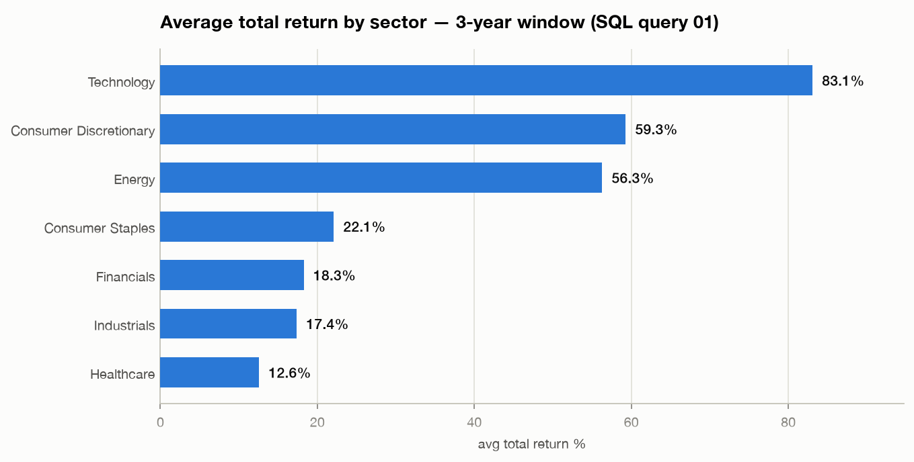
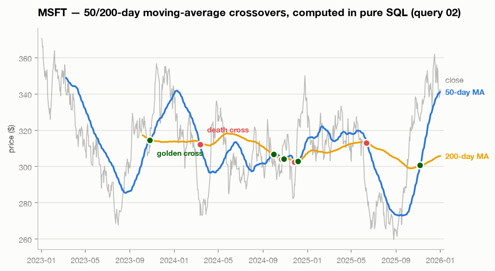
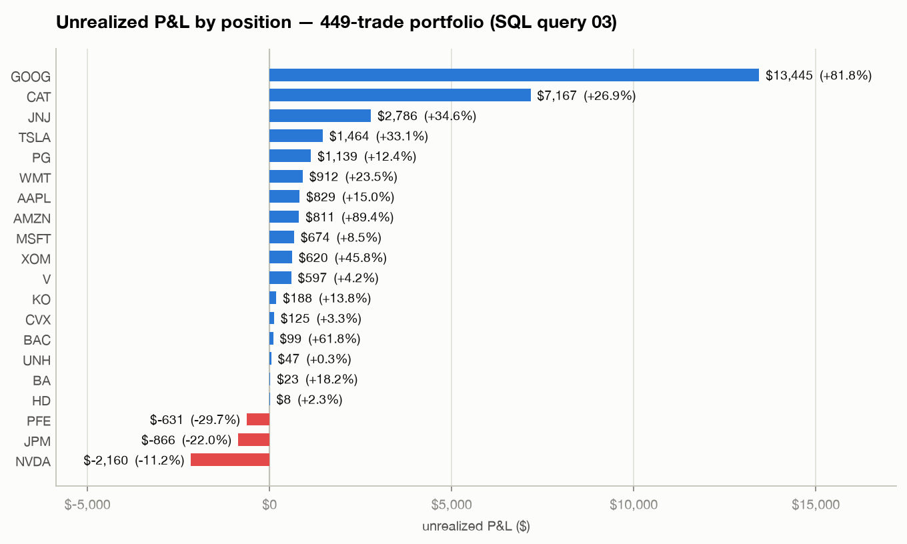

# 📊 SQL Stock Market Analytics

An end-to-end SQL analytics project: a normalized stock-market database (20 tickers, 3 years of daily prices, a 449-trade portfolio log) analyzed with progressively advanced SQL — from aggregations up through window functions — with Tableau-ready outputs.

**Everything here is runnable.** The dataset is generated deterministically (seeded), so cloning the repo and running two commands reproduces every result exactly:

```bash
python3 generate_data.py    # builds data/*.csv (reproducible, seeded)
python3 run_analysis.py     # builds SQLite db, runs all queries, writes outputs/*.csv
```

No external dependencies — Python 3 standard library only.

---

## Database Design

Three normalized tables (see [`schema.sql`](schema.sql)):

```
companies (ticker PK, company_name, sector)
    │
    ├── daily_prices (ticker FK + trade_date → composite PK, OHLCV)
    └── trades (trade_id PK, ticker FK, trade_date, side, quantity, fill_price)
```

Indexes on `daily_prices(trade_date)` and `trades(ticker, trade_date)` support the date-range and per-ticker access patterns the queries use.

## The Queries

| File | Business question | SQL concepts demonstrated |
|---|---|---|
| [`01_sector_performance.sql`](queries/01_sector_performance.sql) | Which sectors performed best over the full period? | JOINs, GROUP BY, aggregates, correlated subqueries |
| [`02_moving_averages.sql`](queries/02_moving_averages.sql) | When did each stock's 50-day MA cross its 200-day MA (golden/death cross)? | Window functions with ROWS frames, LAG, CTE pipelines, CASE |
| [`03_portfolio_pnl.sql`](queries/03_portfolio_pnl.sql) | What is my portfolio's unrealized P&L per position? | Multi-CTE pipelines, conditional aggregation, 3-table joins |
| [`04_monthly_returns_ranked.sql`](queries/04_monthly_returns_ranked.sql) | Who were each month's top-3 performers? | FIRST_VALUE/LAST_VALUE, RANK, date bucketing |

### Sample result — sector performance (query 1)

| sector | companies | avg_latest_close | avg_total_return_pct |
|---|---|---|---|
| Technology | 4 | 440.27 | 83.1 |
| Consumer Discretionary | 3 | 348.62 | 59.3 |
| Energy | 2 | 190.67 | 56.3 |
| Consumer Staples | 3 | 154.74 | 22.1 |
| Financials | 3 | 154.68 | 18.3 |

Full results for every query are committed in [`outputs/`](outputs/).

## Visualized results

Rendered directly from the committed `outputs/` CSVs (light/dark aware):

<picture>
  <source media="(prefers-color-scheme: dark)" srcset="assets/sector_returns_dark.png">
  
</picture>

<picture>
  <source media="(prefers-color-scheme: dark)" srcset="assets/golden_cross_dark.png">
  
</picture>

<picture>
  <source media="(prefers-color-scheme: dark)" srcset="assets/portfolio_pnl_dark.png">
  
</picture>

## Tableau

The files in `outputs/` (plus the raw `data/` CSVs) are designed to drop straight into Tableau:

- **`03_portfolio_pnl.csv`** → treemap of market value by sector/ticker, colored by unrealized P&L %
- **`04_monthly_returns_ranked.csv`** → highlight table of monthly winners over time
- **`data/daily_prices.csv`** → classic price line charts with MA overlays

*Tableau Public dashboard: coming soon — link will be added here.*

## Notes

- Price data is **simulated** (seeded geometric random walk per ticker) rather than scraped, which keeps the repo reproducible, license-clean, and free of API keys. The analysis layer is identical to what would run on real OHLCV data.
- Dialect is SQLite for zero-setup reproducibility; every query uses standard SQL that ports to MySQL/Postgres/SQL Server with minimal changes.
