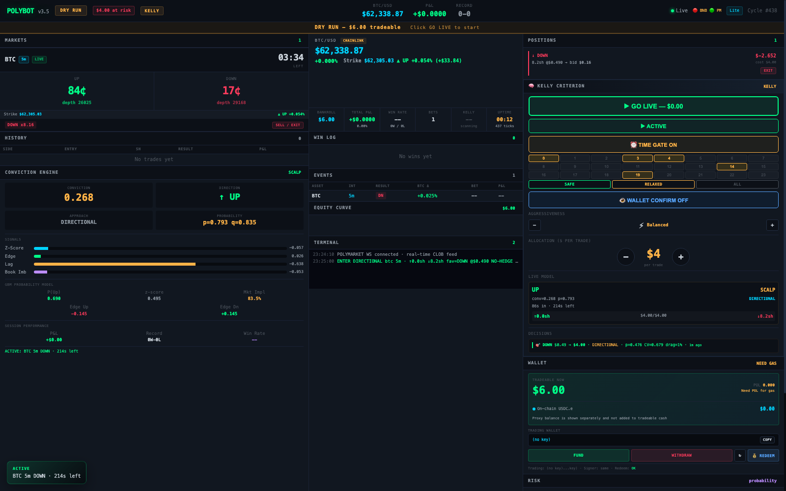
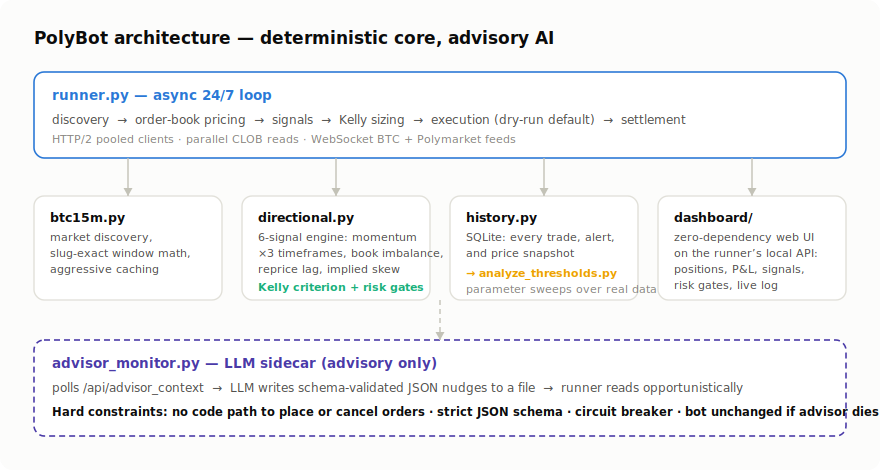

# PolyBot — Polymarket BTC Up/Down Trading Engine

A 24/7 algorithmic trading engine for Polymarket's **BTC 5-minute and 15-minute
Up/Down binary markets**, written in async Python. It discovers each new market window
as it opens, reads live order books, generates directional signals from BTC momentum,
sizes positions with the Kelly criterion, executes (dry-run by default), records every
trade to SQLite, and serves a real-time dashboard — continuously, unattended.

Built February–April 2026. Ran 24/7 on an AWS EC2 instance and on my Mac mini home
server, in dry-run and small-stakes live modes.



*The real dashboard, captured live in **dry-run** mode with no credentials loaded —
order books, the six-signal conviction engine, Kelly sizing controls, and a
simulated position, all against real Polymarket market data.*

> **Honest disclosure up front:** directional betting on 5-minute binary markets is
> gambling-adjacent. The momentum model is a heuristic — I have not proven it has a
> durable statistical edge, and the code says so in its own docstrings. What this
> project demonstrates is the *engineering*: real-time data pipelines, risk
> management, persistence and analytics, and safe AI integration — not a money
> printer. Personal project for my own account; not financial advice.

## Architecture

<picture>
  <source media="(prefers-color-scheme: dark)" srcset="assets/architecture_dark.svg">
  
</picture>

**Signal engine** ([src/directional.py](src/directional.py)) — six inputs across
timeframes: micro momentum (30s of BTC ticks), short momentum (2–3 min, primary),
medium momentum (trend confirmation), order-book bid-depth imbalance, book reprice
lag vs. spot, and implied-probability skew from Up/Down mid prices. The thesis:
Polymarket's books reprice with lag relative to BTC spot, so reading spot momentum
faster than the market maker creates a (theoretical) latency edge.

**Position sizing** — Kelly criterion, `f* = (p·b − q) / b`, capped at fractional
Kelly (default quarter-Kelly) with a hard per-bet bankroll percentage limit.

**Risk management** — session stop-loss halts all betting past a drawdown threshold;
cool-down after consecutive losses; time gates block bets in the first/last seconds
of a window; dry-run is the default everywhere and live trading requires an explicit
`--live` flag.

**Persistence & analytics** ([src/history.py](src/history.py)) — every trade, alert,
and price snapshot lands in SQLite. [analyze_thresholds.py](analyze_thresholds.py)
and [analyze_trades.py](analyze_trades.py) sweep signal thresholds and slice recorded
performance — the feedback loop that turned parameters from guesses into measured
choices. The moving-average momentum ideas here have a pure-SQL counterpart in my
[SQL Stock Analytics](../sql-stock-analytics/) project, which computes the same
family of signals with window functions.

**Dashboard** ([dashboard/](dashboard/)) — a zero-dependency HTML/JS front end over
the runner's local API: live positions, P&L, win/loss, signal state, risk gates, and a
terminal log, with a separate mobile layout.

## The AI advisor sidecar

[src/advisor_monitor.py](src/advisor_monitor.py) is the part I'm most opinionated
about. An LLM polls the runner's `/api/advisor_context` endpoint, receives a
structured snapshot, and may write an advisory nudge to a local JSON file that the
runner reads opportunistically. The constraints are hard:

- the LLM **cannot** place or cancel orders — there is no code path for it
- output must match a strict JSON schema; invalid output is rejected
- timeouts, a circuit breaker, and per-call cool-downs bound every request
- if the advisor is down, slow, or wrong, the deterministic engine is unchanged

That's my working philosophy for AI in high-stakes systems: **AI advises, code
decides.**

## Run it

```bash
python -m venv venv && source venv/bin/activate
pip install -r requirements.txt
cp .env.example .env            # then fill in credentials — see SECURITY notes below

./run.sh                        # dry run (default), dashboard at localhost:8420
python -m src.runner --mode momentum --min-confidence 0.55   # tuned dry run
```

Key flags: `--mode` (composite / momentum / contrarian / book_imbalance),
`--kelly-cap`, `--min-confidence`, `--max-bet-pct`, `--intervals 5m,15m`.
`./start.sh` / `./stop.sh` / `./status.sh` manage it as a background service.

## Security model

Credentials load from `~/.config/polybot/.env` (chmod 600, outside the repo) first,
then a project `.env` for non-sensitive overrides — see
[src/config.py](src/config.py). No secrets, wallet addresses, balances, or trade
history are committed; `.env.example` documents every variable with placeholders.
The config's own summary printer displays whether keys are loaded, never the keys.

## What I'd tell an interviewer about it

- It's **real-time systems work**: HTTP/2 connection pooling, parallel order-book
  reads with `asyncio.gather`, aggressive caching around window boundaries, and a hot
  loop that has to finish its cycle inside a 5-minute market's useful life.
- It's **data work**: the SQLite schema and the threshold-sweep analytics are where
  the actual improvement came from — measured, not vibes.
- It's **honest about uncertainty**: the risk warnings in the code are mine, and the
  default mode is a simulator.
